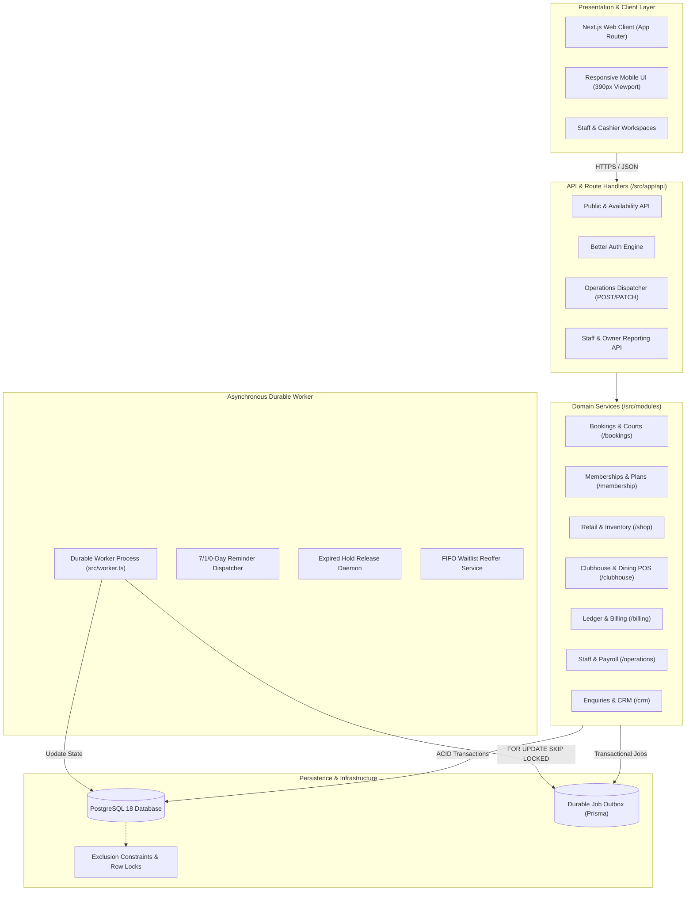
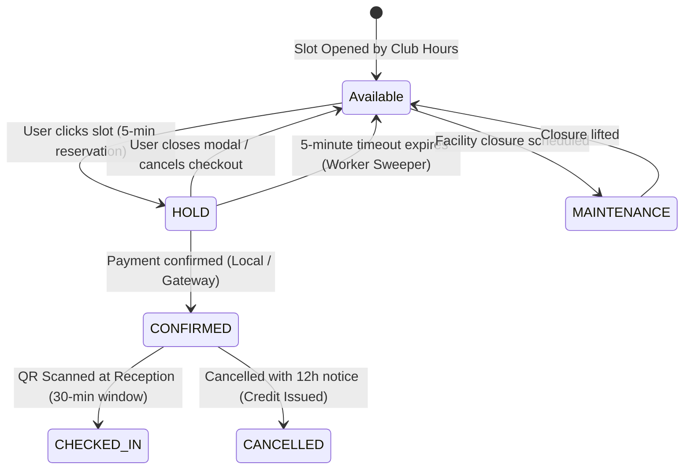
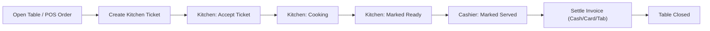
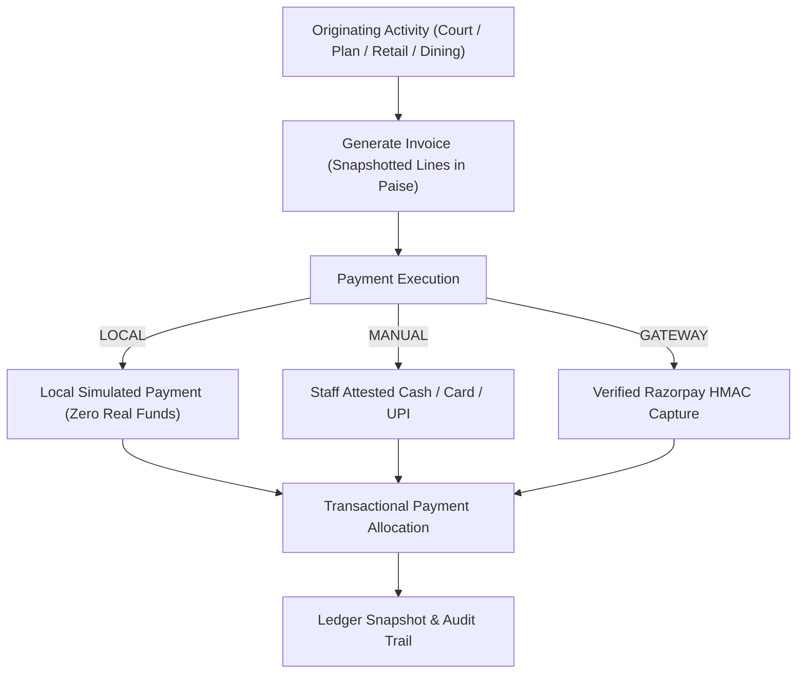

# Champions Club — Enterprise Sports Club Management System

A mission-critical, full-stack monolith for athletic clubs and sports complexes. Built with Next.js App Router, strict TypeScript, Prisma ORM, PostgreSQL, and a separate durable background worker. Designed for enterprise reliability, high-concurrency race protection, offline-resilient staff operations, and financial auditing.

---

## ⚡ Quick Start: How to Run

### Prerequisites
- **Node.js**: `v22.13.0` or later (tested on Node `22.20.0`)
- **PostgreSQL**: PostgreSQL 18
- **Package Manager**: npm

---

### Step-by-Step Setup

1. **Clone and Install Dependencies**:
   ```bash
   git clone https://github.com/Charantej06/Sports-Club-Management-System.git
   cd Sports-Club-Management-System
   npm ci
   ```

2. **Initialize Environment Configuration**:
   ```bash
   npm run setup:env
   ```
   *Generates `.env` with a secure random `BETTER_AUTH_SECRET` if not already present, preserving your custom settings.*

3. **Start the Database (Windows Local PostgreSQL 18)**:
   ```bash
   npm run db:local
   ```
   *Spawns an isolated local PostgreSQL 18 cluster in `.local/postgres` on port `5433` (completely isolated from any system database on 5432).*
   *(On Linux/macOS or if using an existing PostgreSQL instance, set `DATABASE_URL` in `.env` directly).*

4. **Run Migrations & Seed Sample Data**:
   ```bash
   npm run db:generate
   npm run db:migrate
   npm run db:seed
   ```
   *Deploys all 7 versioned relational SQL migrations (with PostgreSQL exclusion constraints, locks, and triggers) and seeds comprehensive demo accounts, courts, 36 shop products, menu items, and past invoices.*

5. **Start the Web Application**:
   ```bash
   npm run dev
   ```
   The application is available at: **[http://localhost:3000](http://localhost:3000)**.

6. **Start the Durable Background Worker** *(Open in a separate terminal)*:
   ```bash
   npm run worker
   ```
   *Handles transactional outbox jobs, automated 7/1/0-day membership reminders, 5-minute hold expirations, FIFO waiting-list offers, and CRM notifications.*

---

## 🔑 Demo Accounts & Credentials

All demo user accounts are pre-seeded with password: **`Champions2026!`**

| Email Address | Role | Persona / Scenarios to Explore |
|---|---|---|
| `owner@champions.local` | **OWNER** | Executive dashboard, revenue/tax reports, cash shift audits, business settings, plans, staff payroll, and system logs. |
| `reception@champions.local` | **RECEPTION** | Daily booking calendar, member check-in, QR scanning, guest walk-ins, CRM leads & quotes, and membership intake. |
| `cashier@champions.local` | **CASHIER** | Retail POS, counter inventory, dine-in table ordering, tab management, cash shift reconciliation, and receipt generation. |
| `kitchen@champions.local` | **KITCHEN** | Live order preparation queue (`Accept` → `Cook` → `Ready`), amended ticket versions, and dietary alerts. |
| `member@champions.local` | **MEMBER** | Active Gold member (`Aarav`), digital Champions QR ID card, court reservations, order history, and billing receipts. |
| `new@champions.local` | **MEMBER** | Fresh user (`Ananya`) without a membership, eligible to purchase standard/trial plans. |
| `junior@champions.local` | **MEMBER** | Under-18 junior account (`Riya`), eligible for age-restricted Junior membership plans. |
| `expired@champions.local` | **MEMBER** | Expired silver member (`Karan`), showing automatic renewal prompts and benefit lapses. |

---

## 🏛️ System Architecture

Champions Club is architected as a modular monolith adhering to Clean Architecture principles. Next.js App Router handles routing, authentication, and HTTP serialization, delegating all domain logic to decoupled business modules in [`src/modules`](file:///d:/ODOO-Sports-Club-System/src/modules).



### Core Architecture Rules & Invariants
1. **Server-Authoritative Business Logic**: Client devices never submit prices, role levels, or discount calculations. The server computes pricing from database snapshots.
2. **Integer Paise Financial Storage**: All monetary amounts are stored as 64-bit integer paise (1 INR = 100 paise) to eliminate floating-point rounding errors.
3. **Asia/Kolkata Business Boundaries**: Timestamps persist in UTC; business days, quotas, and club operating hours (06:00 – 22:00) evaluate strictly in `Asia/Kolkata`.
4. **Immutable Historical Records**: Invoices, credit notes, payment allocations, and finalized payslips are append-only snapshots that can never be mutated after confirmation.
5. **Optimistic & Pessimistic Concurrency**: Row-level locking (`SELECT ... FOR UPDATE`), PostgreSQL exclusion constraints (`EXCLUDE USING gist`), and transactional outbox patterns eliminate race conditions across courts, tables, and inventory.

---

## 🧩 Subsystems & Module Breakdown

---

### 1. Court Booking & Facility Management
*Owned by [`src/modules/bookings/service.ts`](file:///d:/ODOO-Sports-Club-System/src/modules/bookings/service.ts)*

Handles reservation scheduling across 4 core photographic sports (Tennis, Padel, Badminton, and Cricket).



- **5-Minute Server Hold**: When a user selects a court slot, a server-side `HOLD` is atomically acquired with an explicit `holdUntil` timestamp.
- **Immediate Server Release**: If a customer dismisses or closes the checkout dialog, a release mutation (`action: "cancel"`) runs immediately, restoring the slot to green/available status without making other members wait.
- **PostgreSQL Exclusion Constraints**: Overlapping bookings on the same court and time interval are rejected at the database engine level via GiST index constraints.
- **Daily Quotas & Complimentary Sessions**: Enforces member daily limits and automatically deducts complimentary weekly sessions awarded by active membership tiers.
- **Friday Social Mixers & FIFO Waitlist**: Capacity-gated multiplayer events. When a participant cancels, the durable worker automatically claims the next player on the waitlist in strict FIFO order with an expiring 30-minute offer.

---

### 2. Memberships & Contactless Access
*Owned by [`src/modules/membership/service.ts`](file:///d:/ODOO-Sports-Club-System/src/modules/membership/service.ts)*

Manages customer identity, subscription life cycles, and digital membership credentials.

- **Tiered Benefits**: Configurable plans (Gold, Silver, Junior) providing percentage court discounts, complimentary weekly sessions, shop retail discounts, and clubhouse dining privileges.
- **Contiguous Renewal Terms**: Extending an active membership creates contiguous valid date intervals without overwriting past contract terms.
- **Age-Restricted Junior Eligibility**: Enforces strict birthdate validation — Junior plans are only purchasable if the user is under 18 on the term start date.
- **Virtual Digital QR Pass**: Generates dynamic, opaque QR tokens (`qrcode` + `ZXing`). Reception scans or manually verifies the code for single-use court check-in without exposing internal primary keys.
- **Session Revocation**: When an administrator upgrades or revokes member roles, existing user auth sessions are instantly invalidated.

---

### 3. Multi-Channel Retail & Inventory POS
*Owned by [`src/modules/shop/service.ts`](file:///d:/ODOO-Sports-Club-System/src/modules/shop/service.ts)*

Unified e-commerce storefront and physical reception counter sales sharing a single synchronized inventory pool.

- **Variant Stock Tracking**: Manages 36 products across sizing, grip levels, and colors.
- **Isolated Cart Persistence**: Shopping carts are scoped by user account in LocalStorage, completely isolating guest carts from logged-in members.
- **Pickup vs. Delivery Fulfillment**: Pickup orders hold inventory until collected; delivery orders consume stock upon courier dispatch.
- **Audited Restocking & Returns**: Cashiers can process partial item returns, issuing exact pro-rated credits while optionally returning goods to stock or marking them as damaged.
- **Zero-Stock Race Safety**: Atomic database decrement ensures concurrent purchases on the final item in stock award the item to exactly one customer while safely rejecting the other.

---

### 4. Clubhouse Dining & Table POS
*Owned by [`src/modules/clubhouse/service.ts`](file:///d:/ODOO-Sports-Club-System/src/modules/clubhouse/service.ts)*

Complete restaurant and café management linking dining floor tables with real-time kitchen operations.



- **Table Management**: Real-time table status tracking (Available, Active, Billing).
- **Kitchen Preparation Workflow**: Independent ticket states allow kitchen staff to prepare courses while cashiers add amendments without blocking table operations.
- **Member Tabs & Overdue Guards**: Members can charge orders to their account tab up to their configured limit (default: ₹5,000). If unpaid charges exceed 7 days, further credit purchases are blocked automatically.
- **Age-Gated Beverages**: Alcohol or bar items require verified member age (21+) or explicit staff attestation for guests.

---

### 5. Unified Invoicing & Financial Reconciliation
*Owned by [`src/modules/billing/service.ts`](file:///d:/ODOO-Sports-Club-System/src/modules/billing/service.ts)*

Every transaction across court bookings, memberships, pro-shop sales, and dining feeds into a single double-entry ledger.



- **Idempotency Keys**: All financial mutations require unique `Idempotency-Key` headers, guaranteeing duplicate requests cannot create duplicate charges or payments.
- **Cash Float Reconciliation**: Cashiers must record their opening float before starting a shift. When closing, the system compares expected cash (Opening Float + Cash Receipts − Payouts − Refunds) with counted physical cash, enforcing mandatory written explanations for any discrepancy.
- **Executive Financial Reports**: Owners can filter revenue, receipts, credits, and refunds by day, week, month, or custom date ranges with real-time drill-down into every supporting invoice. CSV exports sanitize formulas against CSV-injection attacks.

---

### 6. Human Resources & Staff Payroll
*Owned by [`src/modules/operations/queries.ts`](file:///d:/ODOO-Sports-Club-System/src/modules/operations/queries.ts)*

Internal employee management system with role-segregated privacy controls.

- **Shift Scheduling**: Interactive scheduling with conflict detection preventing overlapping shifts or scheduling during approved employee leave.
- **Leave Requests & Approvals**: Staff submit leave requests with reason and dates; owners approve or reject with comments.
- **Finalized Payslips**: Generates immutable salary snapshots with configurable tax and withholding summaries. Staff can view and print only their own payslips.

---

### 7. Durable Background Worker & Notification Outbox
*Owned by [`src/worker.ts`](file:///d:/ODOO-Sports-Club-System/src/worker.ts)*

A dedicated background daemon operating independently from Next.js web requests.

- **Transactional Outbox**: Business mutations enqueue asynchronous jobs inside the same database transaction that updates business state.
- **High-Concurrency Locking**: Workers claim pending jobs using `SELECT ... FOR UPDATE SKIP LOCKED`, allowing safe horizontal scaling without dual-processing.
- **Scheduled Membership Reminders**: Automatically scans membership terms and dispatches notifications at 7 days, 1 day, and 0 days prior to expiration.
- **Dual Email Adapter**: Supports `EMAIL_MODE=local` (storing messages in the database test inbox for local inspection) and `EMAIL_MODE=smtp` (external delivery via authenticated TLS SMTP).

---

## 🔒 Security & Role-Based Access Control (RBAC)

The platform enforces strict role-based authorization in [`src/lib/access.ts`](file:///d:/ODOO-Sports-Club-System/src/lib/access.ts) on both server actions and API route handlers.

| Capability / Route | Public Visitor | MEMBER | KITCHEN | CASHIER | RECEPTION | OWNER |
|---|:---:|:---:|:---:|:---:|:---:|:---:|
| Browse Sports, Facilities, Pricing | ✅ | ✅ | ✅ | ✅ | ✅ | ✅ |
| Book Courts & Purchase Membership | ❌ | ✅ | ❌ | ❌ | ✅ (Walk-in) | ✅ |
| View Personal Invoices & QR Card | ❌ | ✅ | ❌ | ❌ | ❌ | ✅ |
| Kitchen Preparation Queue | ❌ | ❌ | ✅ | ✅ | ❌ | ✅ |
| POS Dining & Counter Retail POS | ❌ | ❌ | ❌ | ✅ | ❌ | ✅ |
| Cash Shift Float Reconciliation | ❌ | ❌ | ❌ | ✅ | ❌ | ✅ |
| Court Calendar, Check-In & CRM | ❌ | ❌ | ❌ | ❌ | ✅ | ✅ |
| Executive Reports & Financial CSV | ❌ | ❌ | ❌ | ❌ | ❌ | ✅ |
| Staff Payroll & Business Settings | ❌ | ❌ | ❌ | ❌ | ❌ | ✅ |

---

## 🧪 Testing & Verification Suite

The repository contains an exhaustive test suite covering unit calculations, concurrency race conditions, and transactional integrity.

```bash
# 1. Run strict TypeScript validation
npm run typecheck

# 2. Run ESLint code quality suite
npm run lint

# 3. Run automated unit test suite (Cart, Membership, SMTP, Auth)
npm test

# 4. Run real-database integration tests (Requires PostgreSQL 18 on 5433)
npm run test:integration

# 5. Verify Next.js production build bundle
npm run build
```

### Verified High-Concurrency Scenarios
- **Simultaneous Court Booking**: Two concurrent requests for the exact same court and slot; exactly one receives the hold, the second receives an explicit slot-taken error.
- **Concurrent Daily Quota Limit**: Submitting multiple simultaneous bookings for a customer near their quota limit; excess bookings are rejected by database triggers.
- **Final Social Place Race**: Multiple players attempting to join the last remaining spot in a Friday mixer; exactly one succeeds, others are offered waitlist placement.
- **Last Item Stock Depletion**: Parallel checkout attempts on a single remaining inventory item; exactly one transaction claims the SKU, the other transaction rolls back safely.
- **Duplicate Checkout Retries**: Repeatedly submitting identical idempotency keys returns the existing invoice without generating duplicate charges.

---

## 🐳 Docker Deployment (Alternative)

For containerized environments with Docker installed:

```bash
# 1. Build and start containers in the background
docker compose up --build -d

# 2. Seed database inside container
docker compose run --rm app npm run db:seed
```

The containerized stack boots PostgreSQL with persistent volume storage, runs database migrations automatically, and starts both the Next.js production server and the durable background worker under Docker healthchecks.

---

## 📜 Repository Structure

```
.
├── prisma/
│   ├── schema.prisma          # PostgreSQL relational schema (models, relations, enums)
│   ├── seed.ts                # Idempotent database seeder with realistic demo data
│   └── migrations/            # 7 versioned SQL migrations (triggers, exclusion constraints)
├── src/
│   ├── app/                   # Next.js App Router (pages, layouts, API route handlers)
│   │   ├── (auth)/            # Login, registration, password reset flows
│   │   ├── account/           # Customer portal (QR ID card, history, receipts)
│   │   ├── book/              # Interactive court availability and booking grid
│   │   ├── clubhouse/         # Restaurant overview and table dining
│   │   ├── memberships/       # Membership plan comparisons and purchase flow
│   │   ├── shop/              # E-commerce store, product variants, and cart checkout
│   │   ├── staff/             # Restricted staff workspaces (Reception, POS, Kitchen, Admin)
│   │   └── api/               # Authenticated REST endpoints with Zod validation
│   ├── components/            # UI components (Radix primitives, Tailwind CSS)
│   │   ├── courts-view.tsx    # Real-time interactive court scheduler
│   │   ├── operations-ui.tsx  # Modal checkouts, payment actions, and history
│   │   └── gateway-checkout.tsx # Razorpay payment integration component
│   ├── lib/                   # Database client, Better Auth setup, access guards, utility functions
│   ├── modules/               # Domain business logic services
│   │   ├── billing/           # Double-entry ledger, invoice generation, payment allocation
│   │   ├── bookings/          # Court reservation, exclusion locking, Friday social play
│   │   ├── clubhouse/         # Table management, kitchen tickets, member tabs
│   │   ├── membership/        # Subscription tiers, age restrictions, benefit calculation
│   │   ├── shop/              # Product inventory, stock reservations, order fulfillment
│   │   └── operations/        # Cash reconciliation, shift scheduling, staff payroll
│   └── worker.ts              # Durable background daemon for outbox jobs and scheduled reminders
├── tests/                     # Unit and integration test suites
│   ├── cart.test.ts           # Shopping cart isolation and quantity tests
│   ├── mail.test.ts           # SMTP configuration and diagnostic redaction tests
│   ├── rules.test.ts          # Membership terms and pricing validation tests
│   └── integration/           # High-concurrency PostgreSQL operations tests
├── API.md                     # Complete REST API reference and idempotency contracts
├── JUDGING.md                 # Step-by-step evaluator walkthrough and test journeys
├── SPEC.md                    # Detailed business requirements and architectural specification
└── package.json               # Project manifest and scripts
```

---

## 📄 License & Intellectual Property

Champions Club is private and proprietary software developed for the Champions Sports Club ecosystem. All photographic assets in `public/images/` are bundled under verified local licenses documented in [`public/images/ATTRIBUTION.md`](file:///d:/ODOO-Sports-Club-System/public/images/ATTRIBUTION.md).
